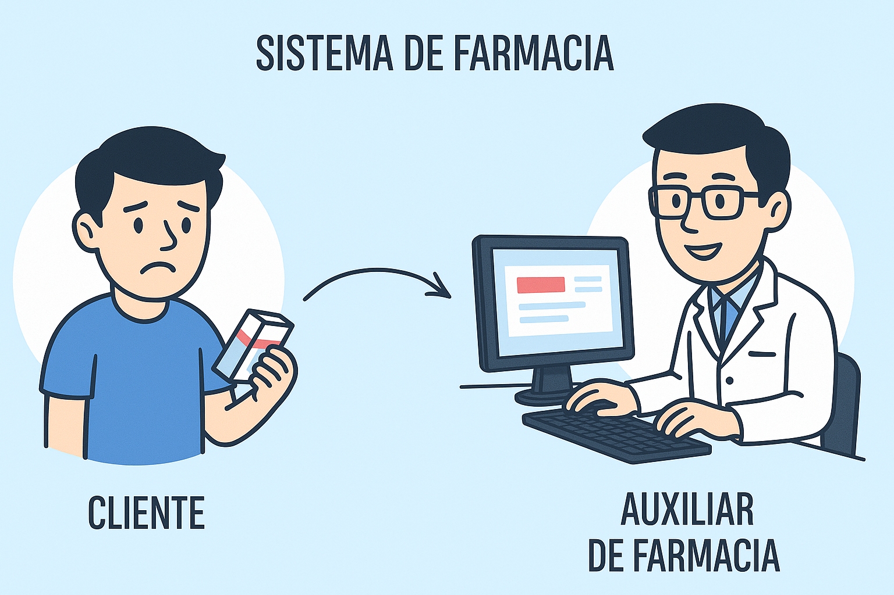

# 💊 Sistema de Farmacia - Flask MVC

<p align="center">
  
</p>

<p align="center">
  
  
  
  
</p>

---

## 📑 Índice

- [📖 Descripción del proyecto](#-descripción-del-proyecto)
- [⚙️ Funcionalidades](#️-funcionalidades)
- [📁 Acceso al proyecto](#-acceso-al-proyecto)
- [🛠️ Cómo ejecutar el proyecto](#️-cómo-ejecutar-el-proyecto)
- [🧰 Tecnologías utilizadas](#-tecnologías-utilizadas)
- [📂 Estructura del proyecto](#-estructura-del-proyecto)
- [👨‍💻 Desarrollador principal](#-desarrollador-principal)
- [📄 Licencia](#-licencia)

---

## 📖 Descripción del proyecto

Sistema de Farmacia es un proyecto en desarrollo para la materia Tecnologías Emergentes II de la carrera de Ingeniería de Sistemas.
Este sistema está diseñado para facilitar y optimizar la gestión integral de farmacias, permitiendo a los auxiliares y personal administrativo registrar, controlar y supervisar las actividades relacionadas con productos farmacéuticos, ventas, compras, movimientos de caja, usuarios y reportes.

Este proyecto fue desarrollado como parte del trabajo final universitario.

---

## ⚙️ Funcionalidades

- 🔐 Autenticación de usuarios con roles y permisos
- 🧾 Gestión de productos, presentaciones y categorías
- 🧪 Gestión de laboratorios
- 🧑‍⚕️ Gestión de clientes
- 🛒 Módulo completo de compras y ventas
- 💰 Módulo de cajas y movimientos de caja
- 📊 Dashboard con gráficas y estadísticas
- 📄 Reportes de ventas
- 📂 Soft delete (borrado lógico de registros)
- 📁 Organización MVC modular y escalable
- 🎨 Interfaz moderna, responsive y atractiva

---

## 📁 Acceso al proyecto

```bash
git clone https://github.com/FreddyJasonQ/sistema-farmacia-flask-mvc.git
cd sistema-farmacia-flask-mvc
```

---

## 🛠️ Cómo ejecutar el proyecto

1. **Crea un entorno virtual:**

```bash
python -m venv venv
source venv/bin/activate   # En Linux/macOS
venv\Scripts\activate      # En Windows
```

2. **Instala las dependencias:**

```bash
pip install -r requirements.txt
```

3. **Ejecuta la aplicación:**

```bash
python run.py
```

4. **Abre tu navegador en:** http://localhost:5000

---

## 🧰 Tecnologías utilizadas

- **Python 3.12**
- **Flask 3.1.1** – Framework web
- **Flask-SQLAlchemy** – ORM para base de datos
- **Flask-Login** – Autenticación de usuarios
- **Flask-WTF & WTForms** – Manejo de formularios seguros
- **Jinja2** – Plantillas HTML dinámicas
- **SQLAlchemy 2.0** – ORM base
- **Werkzeug** – Utilidades WSGI
- **Bootstrap 5.3** – Interfaz moderna y responsive
- **Chart.js** – Visualización de datos

---

## 📂 Estructura del proyecto

```
sistema-farmacia-flask-mvc/
│
├── run.py                  # Punto de entrada de la app
├── config.py               # Configuraciones globales
├── database.py             # Conexión con SQLite
├── requirements.txt        # Dependencias del proyecto
│
├── models/                 # Modelos de la base de datos
│   ├── usuario_model.py
│   ├── producto_model.py
│   └── ...
│
├── controllers/            # Lógica de negocio
│   ├── venta_controller.py
│   ├── caja_controller.py
│   └── ...
│
├── views/                  # Vistas (rutas Flask)
│   ├── usuario_view.py
│   └── ...
│
├── templates/              # Plantillas HTML organizadas
│   ├── base.html
│   ├── ventas/
│   ├── productos/
│   └── ...
│
├── static/                 # Archivos estáticos (CSS/JS)
│   ├── css/
│   ├── js/
│   └── img/
│
├── forms/                  # Formularios WTForms
│   └── forms.py
│
└── utils/                  # Funciones y decoradores
    └── decorators.py
```

---

## 👨‍💻 Desarrollador principal

| [<br><sub>Freddy Yujra Mamani</sub>](https://github.com/FreddyJasonQ) |
| :---: |

📧 freddyuj0@gmail.com

---

## 📄 Licencia

Este proyecto está licenciado bajo la Licencia MIT. Consulta el archivo LICENSE para más información.
